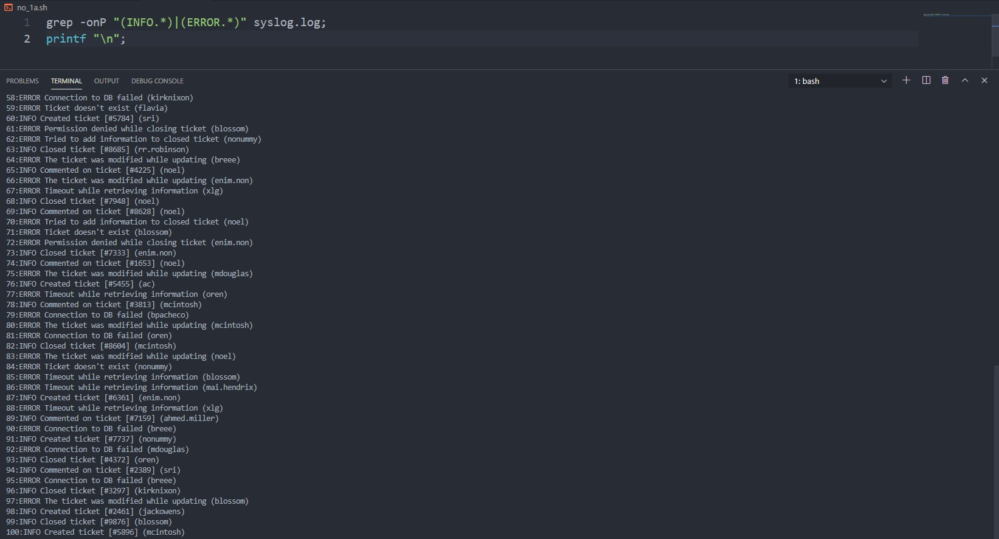

# soal-shift-sisop-modul-1-A01-2021
## Nama Anggota
```
-Erki Kadhafi Rosyid              05111940000050
-Muhammad Valda Rizky Nur Firdaus 05111940000115
-Ahdan Amanullah Irfan Muzhaffar  05111940000197
```
## Soal dan Penjelasan Jawaban
### Soal No.1
Ryujin baru saja diterima sebagai IT support di perusahaan Bukapedia. Dia diberikan tugas untuk membuat laporan harian untuk aplikasi internal perusahaan, ticky. Terdapat 2 laporan yang harus dia buat, yaitu laporan daftar peringkat pesan error terbanyak yang dibuat oleh ticky dan laporan penggunaan user pada aplikasi ticky. Untuk membuat laporan tersebut, Ryujin harus melakukan beberapa hal berikut:

**a.** Mengumpulkan informasi dari log aplikasi yang terdapat pada file syslog.log. Informasi yang diperlukan antara lain: jenis log (ERROR/INFO), pesan log, dan username pada setiap baris lognya. Karena Ryujin merasa kesulitan jika harus memeriksa satu per satu baris secara manual, dia menggunakan regex untuk mempermudah pekerjaannya. Bantulah Ryujin membuat regex tersebut.

**b.** Kemudian, Ryujin harus menampilkan semua pesan error yang muncul beserta jumlah kemunculannya.

**c.** Ryujin juga harus dapat menampilkan jumlah kemunculan log ERROR dan INFO untuk setiap user-nya.

Setelah semua informasi yang diperlukan telah disiapkan, kini saatnya Ryujin menuliskan semua informasi tersebut ke dalam laporan dengan format file csv.

**d.** Semua informasi yang didapatkan pada poin b dituliskan ke dalam file error_message.csv dengan header Error,Count yang kemudian diikuti oleh daftar pesan error dan jumlah kemunculannya diurutkan berdasarkan jumlah kemunculan pesan error dari yang terbanyak.

```
Contoh:
Error,Count
Permission denied,5
File not found,3
Failed to connect to DB,2
```

**e.** Semua informasi yang didapatkan pada poin c dituliskan ke dalam file user_statistic.csv dengan header Username,INFO,ERROR diurutkan berdasarkan username secara ascending.

```
Contoh:
Username,INFO,ERROR
kaori02,6,0
kousei01,2,2
ryujin.1203,1,3
```
**Catatan**:
- Setiap baris pada file syslog.log mengikuti pola berikut:

```
<time> <hostname> <app_name>: <log_type> <log_message> (<username>)
```
- Tidak boleh menggunakan AWK
## Jawaban No.1
**a.** Soal 1.a diperintahkan untuk menampilkan pesan ERROR dan INFO, untuk format yang diperlukan adalah jenis log(ERROR/INFO), pesan log, dan username dari setiap log. Untuk solusinya adalah dengan menggunakan `grep -oP` untuk mengambil pesan ERROR dan INFO. Untuk menyesuaikan format, karena yang diperlukan adalah jenis log dan kalimat setelahnya maka digunakan regex untuk fetch jenis log dan baris setelahnya. Syntax yang digunakan adalah
```bash
grep -oP "(INFO.*)|(ERROR.*)" syslog.log;
printf "\n";
```
`-o` digunakan untuk fetch bagian tertentu dalam baris dan `-P` digunakan untuk memakai syntax regex Pearl.
`.*` digunakan untuk mendapatkan karakter apapun setelah jenis log
`|` digunakan untuk operator **or**

Screenshot hasil untuk no 1a (Kodingan terpisah) ini adalah seperti berikut:

**Kendala:** tidak ditemukan kendala dalam soal ini.

**b.** Untuk menyelesaikan soal ini diperlukan unique pesan error dari syslog.log. Untuk itu digunakan syntax :
```bash
error_sen=$(grep -oP "ERROR.*" syslog.log);
```
Setelah itu dilakukan iterasi untuk setiap error message pada variabel `$error_sen`
```bash
echo "$error_sen" | grep -oP "([A-Z])([a-z]+)(\s[a-zA-Z']+){1,6}" | sort | uniq | 
        while read -r line 
        do
            number=$(grep -c "$line" syslog.log);
            line+=",";
            line+="$number";
            printf "$line\n";
        done | sort -rt',' -nk2;
```
Karena `$error_sen` masih mengandung jenis log dan nama user maka harus dipisahkan dengan menggunakan `grep -oP "([A-Z])([a-z]+)(\s[a-zA-Z']+){1,6}"`, lalu dipilih unique message nya menggunakan ` | sort | uniq | `, setelah itu dilakukan iterasi menggunakan `while read -r` untuk mengconcatenate error message dengan jumlah kemunculan masing masing error message, setelah itu diurutkan berdasarkan jumlah menggunakan `| sort -rt',' -nk2 `.

Screenshot hasil untuk no 1b (Kodingan terpisah) ini adalah seperti berikut:

**Kendala:** tidak ditemukan kendala dalam soal ini.

**c.** Untuk menyelesaikan masalah ini, maka diperlukan nama dari setiap user. Untuk mendapatkannya menggunakan syntax :
```bash
name=$(grep -rohP "(\([a-zA-Z.]+\))" syslog.log | sort | uniq | grep -oP "(?<=\().*(?=\))")
printf "List of users :\n"
echo $name;
```
`(\([a-zA-Z.]+\))` digunakan untuk mendapatkan kata yang berada di dalam parantheses yaitu user, `|sort|uniq|` digunakan untuk memilih unique user, karena hasil yang didapatkan masih menggunakan parantheses maka memerlukan filtering menggunakan `grep -oP "(?<=\().*(?=\))")`.
Setelah mendapatkan unique user, maka dilakukan iterasi untuk setiap user dan menghitung berapa kali user tersebut mendapatkan pesan log menggunakan syntax :
```bash
for i in $name
do
    printf "Name of the user : %s\n" $i;
    printf "Amount of error : ";
    grep -cP "ERROR.*($i)" syslog.log;
    printf "Amount of info : ";
    grep -cP "INFO.*($i)" syslog.log;
    printf "%s,%d,%d\n" $i $(grep -cP "INFO.*($i)" syslog.log) $(grep -cP "ERROR.*($i)" syslog.log);
done
```
karena unique user disimpan di dalam variabel `$name`, maka iterasi digunakan pada variabel tersebut. Lalu untuk setiap user dihitung pesan log yang dihasilkan dengan menggunakan `grep -cP "ERROR.*($i)" syslog.log`.

Screenshot hasil untuk no 1c (Kodingan terpisah) ini adalah seperti berikut:

**Kendala:** tidak ditemukan kendala dalam soal ini.

**d.** Untuk menyelesaikan soal ini diperlukan unique pesan error dari syslog.log. Untuk itu digunakan syntax :
```bash
error_sen=$(grep -oP "ERROR.*" syslog.log);
```
Lalu untuk menyesuaikan header pada error_message.csv digunakan syntax
```bash
printf "Error, Count\n" > error_message.csv;
```
Setelah itu dilakukan iterasi untuk setiap error message pada variabel `$error_sen`
```bash
echo "$error_sen" | grep -oP "([A-Z])([a-z]+)(\s[a-zA-Z']+){1,6}" | sort | uniq | 
        while read -r line 
        do
            number=$(grep -c "$line" syslog.log);
            line+=",";
            line+="$number";
            printf "$line\n";
        done | sort -rt',' -nk2 >> error_message.csv;
```
Karena `$error_sen` masih mengandung jenis log dan nama user maka harus dipisahkan dengan menggunakan `grep -oP "([A-Z])([a-z]+)(\s[a-zA-Z']+){1,6}"`, lalu dipilih unique message nya menggunakan ` | sort | uniq | `, setelah itu dilakukan iterasi menggunakan `while read -r` untuk mengconcatenate error message dengan jumlah kemunculan masing masing error message, setelah itu diurutkan berdasarkan jumlah menggunakan `| sort -rt',' -nk2 >> error_message.csv` dan menambahkan nya ke file error_message.csv.

Screenshot hasil untuk no 1d (Kodingan terpisah) ini adalah seperti berikut:

**Kendala:** tidak ditemukan kendala dalam soal ini.

**e.** Untuk soal ini diperlukan nama setiap user dahulu menggunakan syntax seperti no **1.b** yaitu:
```bash
name=$(grep -rohP "(\([a-zA-Z.]+\))" syslog.log | sort | uniq | grep -oP "(?<=\().*(?=\))");
```
lalu membuat header di user_statistic.csv menggunakan:
```bash
printf "Username,INFO,ERROR\n" > user_statistic.csv;
```
Setelahnya dilakukan iterasi untuk setiap nama dalam variabel `$name` dan mencari jumlah ERRROR dan INFO untuk setiap user menggunakan :
```bash
for i in $name
do
    printf "%s,%d,%d\n" $i $(grep -cP "INFO.*($i)" syslog.log) $(grep -cP "ERROR.*($i)" syslog.log);
done |sort >> user_statistic.csv;
```
syntax `|sort >> user_statistic.csv` digunakan untuk mengurutkan data berdasarkan nama secara ascending dan memasukkannya ke dalam file user_statistic.csv

Screenshot hasil untuk no 1e (Kodingan terpisah) ini adalah seperti berikut:

**Kendala:** tidak ditemukan kendala dalam soal ini.

### Soal No.2 
Steven dan Manis mendirikan sebuah startup bernama “TokoShiSop”. Sedangkan kamu dan Clemong adalah karyawan pertama dari TokoShiSop. Setelah tiga tahun bekerja, Clemong diangkat menjadi manajer penjualan TokoShiSop, sedangkan kamu menjadi kepala gudang yang mengatur keluar masuknya barang.

Tiap tahunnya, TokoShiSop mengadakan Rapat Kerja yang membahas bagaimana hasil penjualan dan strategi kedepannya yang akan diterapkan. Kamu sudah sangat menyiapkan sangat matang untuk raker tahun ini. Tetapi tiba-tiba, Steven, Manis, dan Clemong meminta kamu untuk mencari beberapa kesimpulan dari data penjualan “Laporan-TokoShiSop.tsv”.

**a.** Steven ingin mengapresiasi kinerja karyawannya selama ini dengan mengetahui Row ID dan profit percentage terbesar (jika hasil profit percentage terbesar lebih dari 1, maka ambil Row ID yang paling besar). Karena kamu bingung, Clemong memberikan definisi dari profit percentage, yaitu:

```
Profit Percentage = (Profit Cost Price) 100
```

Cost Price didapatkan dari pengurangan Sales dengan Profit. (Quantity diabaikan).

**b.** Clemong memiliki rencana promosi di Albuquerque menggunakan metode MLM. Oleh karena itu, Clemong membutuhkan daftar nama customer pada transaksi tahun 2017 di Albuquerque.

**c.** TokoShiSop berfokus tiga segment customer, antara lain: Home Office, Customer, dan Corporate. Clemong ingin meningkatkan penjualan pada segmen customer yang paling sedikit. Oleh karena itu, Clemong membutuhkan segment customer dan jumlah transaksinya yang paling sedikit.

**d.** TokoShiSop membagi wilayah bagian (region) penjualan menjadi empat bagian, antara lain: Central, East, South, dan West. Manis ingin mencari wilayah bagian (region) yang memiliki total keuntungan (profit) paling sedikit dan total keuntungan wilayah tersebut.

Agar mudah dibaca oleh Manis, Clemong, dan Steven, (e) kamu diharapkan bisa membuat sebuah script yang akan menghasilkan file “hasil.txt” yang memiliki format sebagai berikut:
```
Transaksi terakhir dengan profit percentage terbesar yaitu *ID Transaksi* dengan persentase *Profit Percentage*%.

Daftar nama customer di Albuquerque pada tahun 2017 antara lain:
*Nama Customer1*
*Nama Customer2* dst

Tipe segmen customer yang penjualannya paling sedikit adalah *Tipe Segment* dengan *Total Transaksi* transaksi.

Wilayah bagian (region) yang memiliki total keuntungan (profit) yang paling sedikit adalah *Nama Region* dengan total keuntungan *Total Keuntungan (Profit)*
```
**Catatan**:
- Gunakan bash, AWK, dan command pendukung
- Script pada poin (e) memiliki nama file ‘soal2_generate_laporan_ihir_shisop.sh’
### Jawaban No.2
**a.** Untuk Soal 2a karena diminta untuk mencari pemilik (id transaksi) dan nilai max dari profit percentage (dijelaskan di soal). Oleh karena itu, pertama meng-inisialisasi di awal nilai `max = 0` lalu memulai program awk:
```bash
awk -F "\t" 'BEGIN {max=0} 
```
untuk pengecekan per barisnya akan dilakukan :
```bash
if(NR!=1)
{
    cost = ($21/($18 - $21)*100);
    if(cost >= max){max = cost;ROWID = $1;ORDID=$2}
} 
```
`if(NR!=1)` diberikan agar tidak membaca baris pertama dari tabel karena berisi nama kolom bukan value yang dicari.

Setelah `cost` dari tiap baris didapatkan akan dibandingkan dengan max yang ada, jika lebih atau sama dengan dari max maka `ORDID` akan diambil dari kolom 2 baris tersebut.

Akhirnya diberikan `END` dan hasilnya akan di masukkan ke `hasil.txt` :
```bash
END {
    print "Transaksi terakhir dengan profit percentage terbesar yaitu",ORDID,"dengan persentase",max,"%\n"
}' Laporan-TokoShiSop.tsv > hasil.txt
```
`>` dipakai untuk membuat membuat file baru/menimpa file yang sudah ada `hasil.txt`

Screenshot hasil untuk no 2a (Kodingan terpisah) ini adalah seperti berikut:

**Kendala:** tidak ditemukan kendala dalam soal ini.

**b.** Pertama, memberikan perintah `BEGIN` untuk print apa yang diinstruksikan di soal:
```bash
awk -F "\t" 'BEGIN {
    print "Daftar nama customer di Albuquerque pada tahun 2017 antara lain:"
    } 
```
Lalu untuk mencari data transaksi yang terjadi pada tahun 2017 maka digunakan:
```bash
$3 ~ /[0-9][0-9]-[0-9][0-9]-17/ 
```
Kode diatas bermaksud mengecek kolom ke-3 (waktu transaksi) dan mengeceknya apakah terjadi di tahun 2017 (yang dicocokan hanya pada tahun 2017 nya. Tanggal dan bulannya bebas).

Lalu apabila transaksi tersebut terjadi di tahun 2017 maka dilakukan :
```bash
{
    if($10 == "Albuquerque")
    a[$7]++
}
```
untuk memfilter apakah customer berada di Albuquerque. Jiak iya maka nama customer (kolom ke-7) akan ditambahkan ke dalam array `a[]`.

Lalu setelah semua difilter maka nantinya customer yang telah ditambahkan akan diprint siapa saja yang melakukan transaksi pada tahun 2017 dan berada di Albuquerque:
```bash
END { 
    for (b in a) 
    { 
        print b
    }
}' Laporan-TokoShiSop.tsv >> hasil.txt
```
Perulangan tersebut hanya mengeluarkan nama yang telah dimasukkan **1 kali** sehingga tidak berulang. Hasilnya akan ditambahkan ke `hasil.txt`

Screenshot hasil untuk no 2b (Kodingan terpisah) ini adalah seperti berikut:

**Kendala:** tidak ditemukan kendala dalam soal ini.

**c.** Untuk menghitung jumlah segmen transaksi yang paling sedikit maka akan dihitung setiap barisnya sehingga akan didapatkan jumlah dari setiap segmen :
```bash
awk -F "\t" '{
    if(NR!=1)a[$8]++
    }
```
Tiap baris, kolom ke-8 (segmen) akan ditambahkan ke array masing-masing sehingga dapat diketahui banyak tiap segmen

Lalu array dari tiap segmen akan dibandingkan sehingga didapatkan jumlah minimalnya:
```bash
END {
    min = a["Consumer"];
    tag = "Customer"
    for(b in a)
        if(a[b] < min) {
            min = a[b];
            tag = b;
        }
    print "\nTipe segmen customer yang penjualannya paling sedikit adalah",tag,"dengan",min,"transaksi.\n"
}' Laporan-TokoShiSop.tsv >> hasil.txt
```
Hasilnya akan ditambahkan ke `hasil.txt`

Screenshot hasil untuk no 2c (Kodingan terpisah) ini adalah seperti berikut:

**Kendala:** tidak ditemukan kendala dalam soal ini.

**d.** Untuk mendapatkan wilayah yang mendapatkan keuntungan terkecil caranya hampir sama seperti 2c namun nantinya tiap array dari masing-masing wilayah akan ditambahkan dengan nilai profitnya (bukan banyak wilayah) :
```bash
awk -F "\t" '{
    if(NR!=1)a[$13]+=$21
    }
```
Kolom ke-21 `$21` akan ditambahkan ke array dari wilayah yang discan di baris tersebut (`$13`).

lalu untuk membandingkan wilayah mana yang mempunyai keuntungan terkecil caranya seperti yang tertera di no.`2c`
```bash
END {
    min = a["South"];
    tag = "South"
    for(b in a)
        if(a[b] < min){
            min = a[b];
            tag = b;
    }
    printf "Wilayah bagian (region) yang memiliki total keuntungan (profit) yang paling sedikit adalah %s dengan total keuntungan %f",tag,min
}' Laporan-TokoShiSop.tsv >> hasil.txt
```
Hasilnya akan ditambahkan ke `hasil.txt`

Screenshot hasil untuk no 2d (Kodingan terpisah) ini adalah seperti berikut:

**Kendala:** tidak ditemukan kendala dalam soal ini.

### Soal No. 3
**a.** Membuat script untuk mengunduh 23 gambar dari "https://loremflickr.com/320/240/kitten" serta menyimpan log-nya ke file "Foto.log". Karena gambar yang diunduh acak, ada kemungkinan gambar yang sama terunduh lebih dari sekali, oleh karena itu kalian harus menghapus gambar yang sama (tidak perlu mengunduh gambar lagi untuk menggantinya). Kemudian menyimpan gambar-gambar tersebut dengan nama "Koleksi_XX" dengan nomor yang berurutan tanpa ada nomor yang hilang (contoh : Koleksi_01, Koleksi_02, ...)

**b.** Karena Kuuhaku malas untuk menjalankan script tersebut secara manual, ia juga meminta kalian untuk menjalankan script tersebut sehari sekali pada jam 8 malam untuk tanggal-tanggal tertentu setiap bulan, yaitu dari tanggal 1 tujuh hari sekali (1,8,...), serta dari tanggal 2 empat hari sekali(2,6,...). Supaya lebih rapi, gambar yang telah diunduh beserta log-nya, dipindahkan ke folder dengan nama tanggal unduhnya dengan format "DD-MM-YYYY" (contoh : "13-03-2023").

**c.** Agar kuuhaku tidak bosan dengan gambar anak kucing, ia juga memintamu untuk mengunduh gambar kelinci dari "https://loremflickr.com/320/240/bunny". Kuuhaku memintamu mengunduh gambar kucing dan kelinci secara bergantian (yang pertama bebas. contoh : tanggal 30 kucing > tanggal 31 kelinci > tanggal 1 kucing > ... ). Untuk membedakan folder yang berisi gambar kucing dan gambar kelinci, nama folder diberi awalan "Kucing_" atau "Kelinci_" (contoh : "Kucing_13-03-2023").

**d.** Untuk mengamankan koleksi Foto dari Steven, Kuuhaku memintamu untuk membuat script yang akan memindahkan seluruh folder ke zip yang diberi nama “Koleksi.zip” dan mengunci zip tersebut dengan password berupa tanggal saat ini dengan format "MMDDYYYY" (contoh : “03032003”).

**e.** Karena kuuhaku hanya bertemu Steven pada saat kuliah saja, yaitu setiap hari kecuali sabtu dan minggu, dari jam 7 pagi sampai 6 sore, ia memintamu untuk membuat koleksinya ter-zip saat kuliah saja, selain dari waktu yang disebutkan, ia ingin koleksinya ter-unzip dan tidak ada file zip sama sekali.

**Catatan**:
- Gunakan bash, AWK, dan command pendukung
- Tuliskan semua cron yang kalian pakai ke file cron3[b/e].tab yang sesuai


### Jawaban No.3
**a.** Pada soal 3a ini ingin membuat sebuah skrip untuk me-downlaod sebuah foto dari https://loremflickr.com/320/240/kitten dengan ketentuan gambar tidak boleh kembar dan penamaannya diganti menjadi "Koleksi_XX" dengan "XX" sesuai urutan download

untuk mendownload file menggunakan command wget dan juga akan menyimpan log dari pendownload an di "Foto.log"
```
no=1
while [ $no -le 23 ]
 do
	wget -a Foto.log -nv  https://loremflickr.com/320/240/kitten
	no=$((no+1))
 done
```
setelah di download akan dilakukan sorting menggunakan awk dengan mengecek dari md5 tiap file dan dilihat dari baris pertama md5, jika sama akan diremove 

```
md5sum * | sort | awk 'BEGIN{hash = ""} $1 == hash {print $2} {hash = $1}' | xargs rm
```

untuk mengubah nama akan melakukan loop dan nama file foto akan diubah sesuai dengan yang diminta soal dengan mencari nama file dengan awalan "Kitten*" lalu digantidengan awalan "Koleksi*"

```
s=1
for file in *
do
	if [[ $file == *"kitten"* ]]
	then
		namafile=`printf "Koleksi_%02d.jpg" $s`
		mv $file $namafile
		s=$((s+1))
	fi
done
```


**a.**
